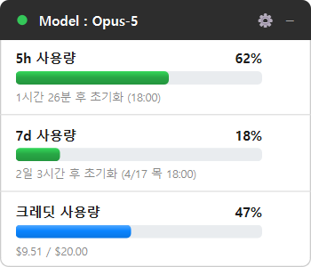
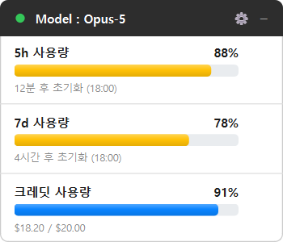
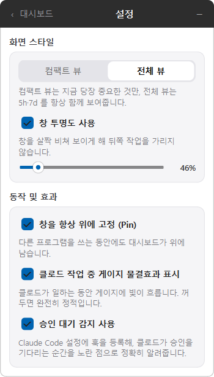

# ClaudeTray

Windows 시스템 트레이에서 Claude Code의 사용량(Quota)과 추가 결제 크레딧을 실시간으로 추적하는 Qt6 기반 모니터링 프로그램입니다.

[](https://github.com/wkuMyeungsu/Claude-Tracker/releases/tag/v1.2.0)
   

---

## 대시보드 화면



---

## 주요 기능

- **실시간 사용량 추적**: 5시간 및 7일 토큰 사용률과 리셋 카운트다운을 게이지바로 시각화
- **추가 결제 크레딧 모니터링**: 초과 사용 시 결제 크레딧($)의 남은 한도 및 사용액을 블루 테마로 일관되게 표시
- **실시간 훅(Hook) 연동**: Claude Code의 작업 상태(대기 / 툴 실행 중 / 승인 대기)를 원형 상태등으로 정확히 표시
- **오프라인 로컬 추적 및 자가 학습(LMS)**: API 지연 시 로컬 대화 로그를 정규화 LMS 알고리즘으로 분석해 소모 비용 자동 보정
- **스마트 UI/UX**: 동적 슬라이드 애니메이션 설정 패널, 항상 위 고정(Pin), 자동 투명도 전환 지원

---

## 설치 및 실행 (v1.2.0)

[릴리즈 페이지](https://github.com/wkuMyeungsu/Claude-Tracker/releases/tag/v1.2.0)에서 다운로드할 수 있습니다.

| 파일 | 용도 |
| --- | --- |
| `claude-tracker-1.2.0-win64.msi` | 설치 프로그램 (권장) |
| `claude-tracker-1.2.0-win64.zip` | 무설치 휴대용 (압축 해제 후 `bin\ClaudeTray.exe` 실행) |

- **Qt 별도 설치 불필요**: 실행에 필요한 Qt 런타임과 플러그인이 모듈화되어 동봉되어 있습니다.
- **요구사항**: Windows 10 / 11 (64비트), Claude Code 로그인 상태 (`~/.claude/.credentials.json`)

---

## 상세 화면 및 설정

<details>
<summary><b>1. 한도 경고 상태 (초록 / 주황 / 빨강)</b></summary>

- **~70% (안전)**: 초록색
- **71%~85% (주의)**: 주황색
- **86%~ (임계)**: 빨간색



</details>

<details>
<summary><b>2. 설정 슬라이드 패널</b></summary>

- `⚙` 설정 버튼 클릭 시 설정 패널로 부드럽게 슬라이드 전환됩니다.
- 뷰 모드(컴팩트 / 전체), 창 투명도, 항상 위 고정(Pin), 게이지 물결 효과, 훅 승인 대기 감지 여부를 설정할 수 있습니다.



</details>

---

<details>
<summary><b>개발자 가이드 (빌드, 테스트 및 프로젝트 구조)</b></summary>

### 빌드 방법 (PowerShell)

```powershell
$QtRoot  = "C:\Qt"
$QtVer   = "6.11.1"
$MinGW   = "mingw1310_64"

$QtKit = "$QtRoot\$QtVer\mingw_64"
$env:PATH = "$QtKit\bin;$QtRoot\Tools\$MinGW\bin;" +
            "$QtRoot\Tools\Ninja;$QtRoot\Tools\CMake_64\bin;$env:PATH"

$Kit = $QtKit.Replace('\','/'); $Tools = $QtRoot.Replace('\','/') + "/Tools/$MinGW/bin"

cmake -S . -B build -G Ninja -DCMAKE_BUILD_TYPE=Release `
    -DCMAKE_PREFIX_PATH="$Kit" `
    -DCMAKE_CXX_COMPILER="$Tools/g++.exe"

cmake --build build
./build/ClaudeTray.exe
```

### 테스트 실행

```powershell
cd build
ctest --output-on-failure
```

### 배포 패키지 생성

```powershell
cd build
cpack          # claude-tracker-<버전>-win64.msi / .zip 생성
```

### 파일 구조

```
src/
  core/   순수 계산 — Qt Widgets·네트워크 비의존. 단위 테스트 링크 타깃
  data/   외부 입력 — JSONL 대화 로그, API 클라이언트, 자격 증명, 훅 연동
  ui/     화면 위젯 — 대시보드 창, 게이지바, 상태점, 토글 스위치
  app/    조립 및 흐름 제어 — 트레이 컨트롤러
```

</details>

---

## 라이선스

MIT License
